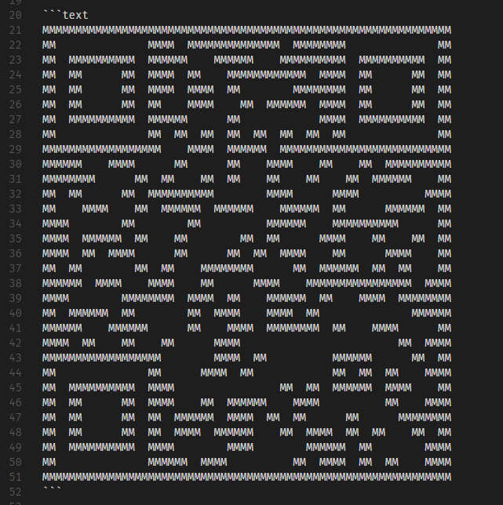

# qr-ascii

A small library to generate QR codes with ascii.

## Preview

<a target="_blank" href="http://justjavac.com/javascript/2017/04/21/a-small-library-to-generate-qr-codes-with-ascii.html">demo</a>

## Credits

- [justjavac](https://github.com/justjavac)

## License

qr-ascii is released under the GPL License. See the bundled [LICENSE](./LICENSE) file for details.